# CPE 322-A Lab 1: GHDL and GTKWave

## Assignment Overview
The instructions for the lab were as follows:
* Go to the GitHub repository of Digital System Design (DSD)
  * Study VHDL and GHDL
* Go to the GHDL folder
  * Install GHDL and GTKWave
  * Run Half Adder Example
  * Run another example such as D Flip-Flop or 4-to-1 Multiplexer
  * Document results on your GitHub repository
* Exploration: [Icarus Verilog](https://en.wikipedia.org/wiki/Icarus_Verilog)

## What is VHDL?
* GHDL is an open-source simulator for the VHDL language
* I found a website which explained VHDL very nicely since I was still confused about it when starting this lab
* From allaboutcircuits.com
> "VHDL is one of the commonly used Hardware Description Languages (HDL) in digital circuit design. VHDL stands for VHSIC Hardware Description Language. In turn, VHSIC stands for Very-High-Speed Integrated Circuit."
* I ran the half adder, full adder, D flip-flip, T flip-flop, 4-to-1 multiplexer, and 1-to-4 multiplexer and included the results from viewing them in GTKWAVE here

## Results
The first thing that I did after installing everything following the steps from Professor Lu's DSD repo was a hello world program
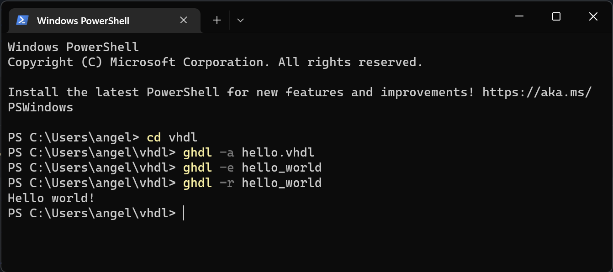
After that worked out nicely I started running some examples that were reccomended by Professor Lu.
There are very nice instructions in his DSD repo for running all of these, but if you want to follow along you can also look at the snippets I provided of the exact code that I entered into powershell to get them running.

Here are all of the examples I did, with the commands in powershell and the output in GTKWave
### Half Adder
In powershell the commands look like this:
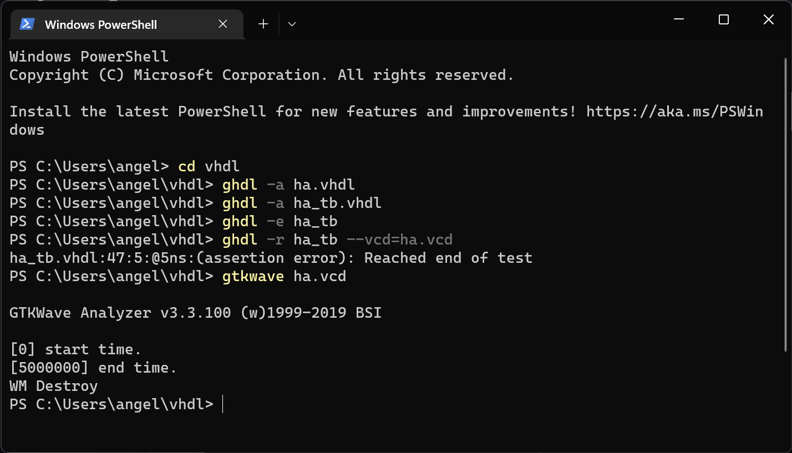
and the output looks like this:
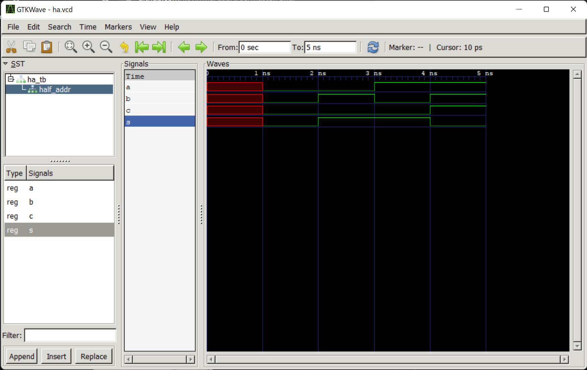

### Full Adder
In powershell the commands look like this:
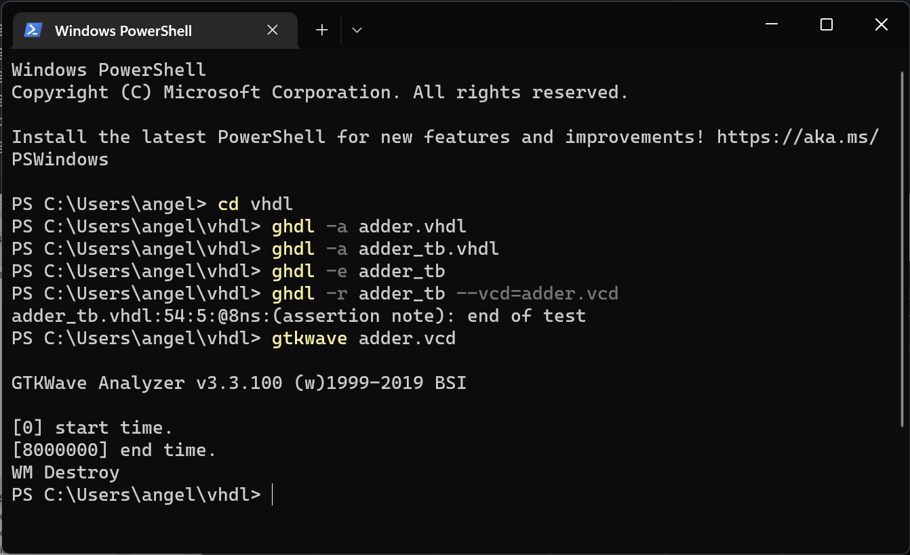
and the output looks like this:
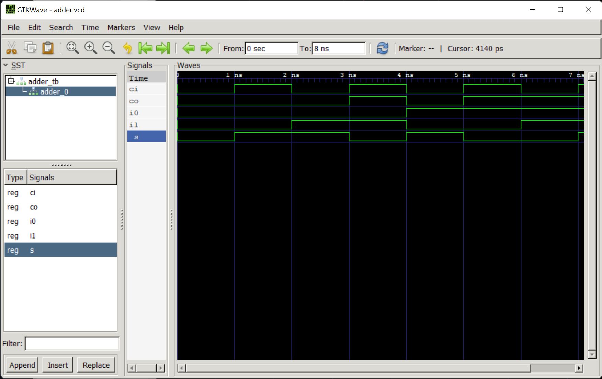

### D Flip-Flop
In powershell the commands look like this:
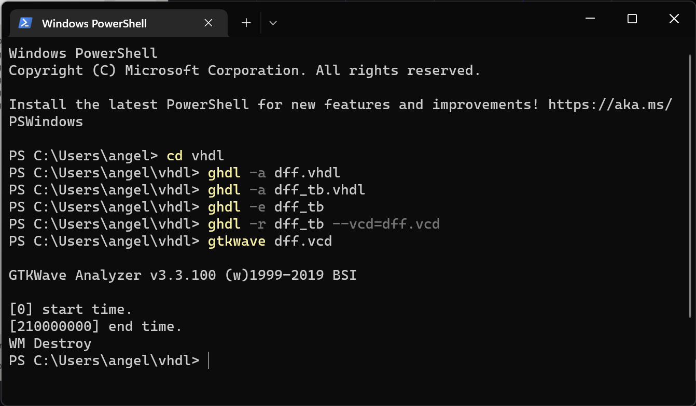
and the output looks like this:
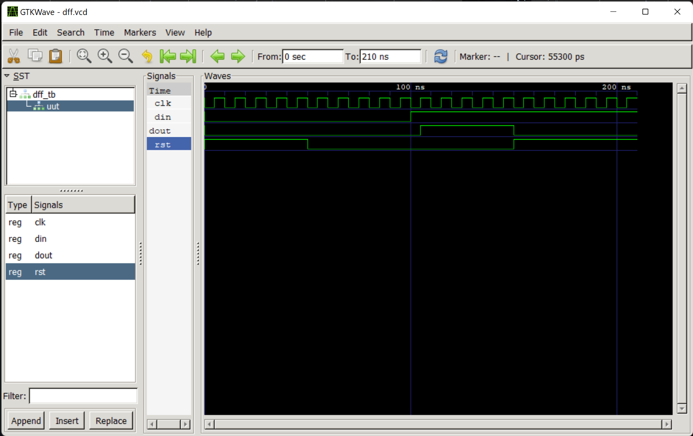

### T Flip-Flop
In powershell the commands look like this:
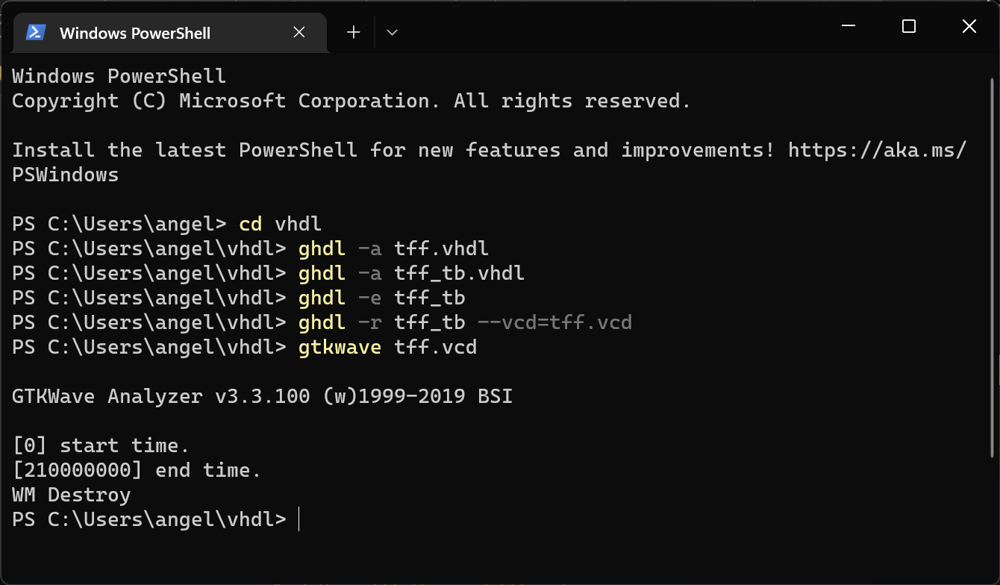
and the output looks like this:
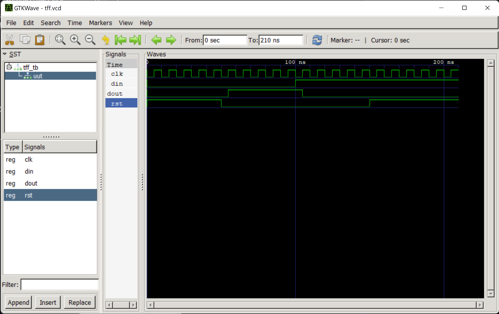

### 4-to-1 Multiplexer
In powershell the commands look like this:
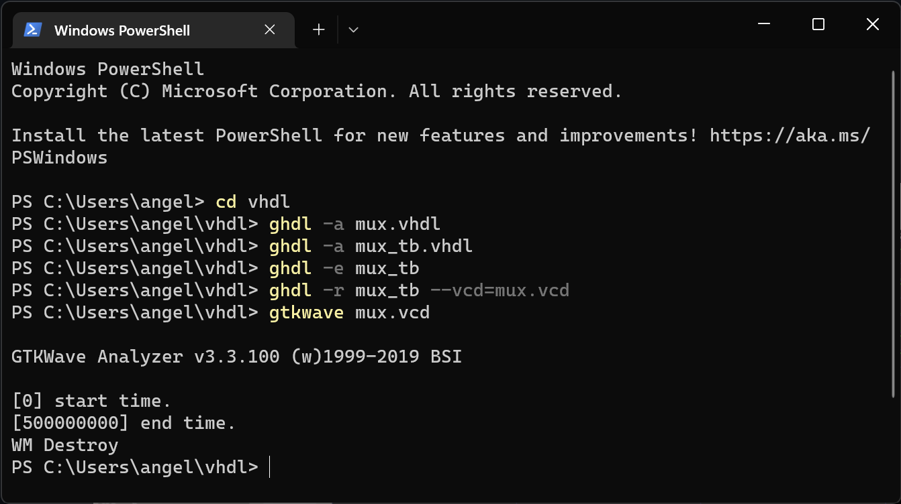
and the output looks like this:
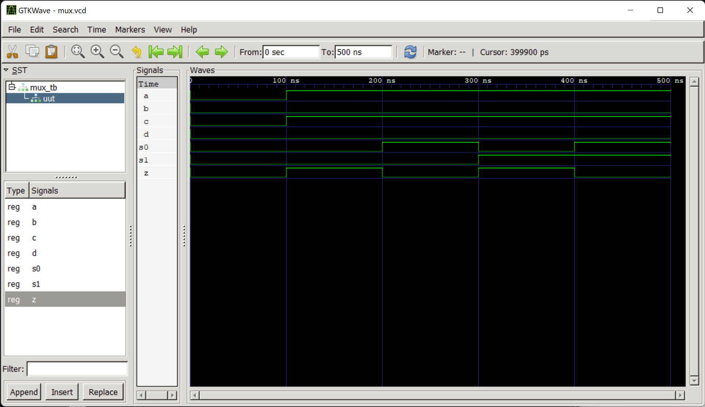

### 1-to-4 Miltiplexer
In powershell the commands look like this:
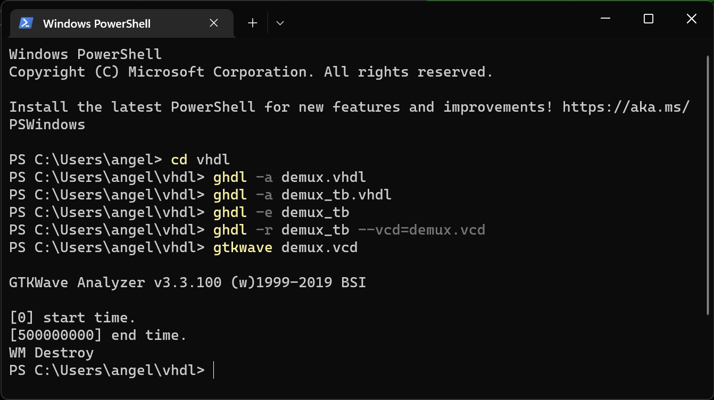
and the output looks like this:
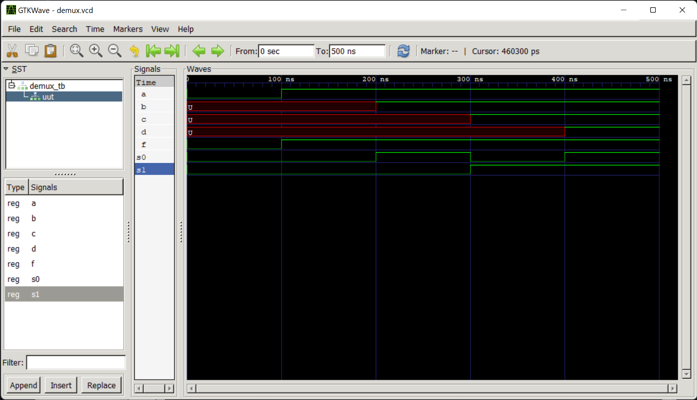

## References
* [GHDL README.md in DSD GitHub Repo](https://github.com/kevinwlu/dsd/tree/master/ghdl)
* [Article Explaining VHDL](https://www.allaboutcircuits.com/technical-articles/hardware-description-langauge-getting-started-vhdl-digital-circuit-design/)

## Stevens Institute of Technology, Computer Engineering, class of 2024

 
