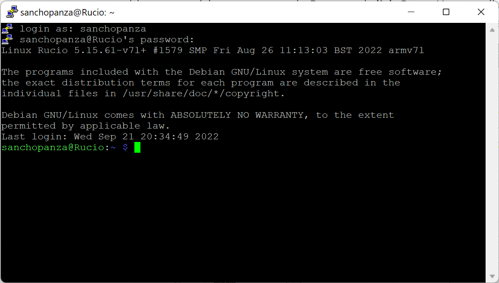

# CPE 322-A Lab 2: Command Line

## Assignment Overview
The instructions for the lab were as follows:
* Go to the IOT repository
* Study lessons 1 and 2
* Open a terminal 

~~~
$ hostname
$ env
$ ps
$ pwd
$ git clone https://github.com/kevinwlu/iot.git
$ cd iot
$ ls
$ cd
$ df
$ mkdir demo
$ cd demo
$ nano file
$ cat file
$ cp file file1
$ mv file file2
$ rm file2
$ clear
$ man uname
$ uname -a
$ ifconfig
$ ping localhost
$ netstat
~~~

## Setting Up Raspberry Pi Again
* I am sad to say that I have not used my Pi very much since CPE 390
* One of the last things I did was set it up to mine an obscure cryptocurrency called magicoin
* I believe that project may have screwed it up a bit so I set it up fresh following the IOT repo [Lesson One](https://github.com/kevinwlu/iot/tree/master/lesson1)
* I used the Tom's Hardware guide to setting up a "headless" pi so that I could try something new and set it up in a way I had not done before

It took some fiddling but after a couple of wipes of the sd card and retrying to connect through putty I finally got it

I also set up the VNC viwer to be able to use my pi completely from my laptop with no additional monitor, keyboard, or mouse

> fun fact, if you don't understand the references made in my pi login and hostname. These are names from Don Quijote, a great book by Spanish author Miguel de Cervantes. My laptop is named Rocinante after Don Quijote's horse, so I named my pi Rucio after Sancho Panza's donkey.

## Results
* To be continued...

## References
* [IOT Repo](https://github.com/kevinwlu/dsd/tree/master)
* [How to Set Up a Headless Raspberry Pi, Without Ever Attaching a Monitor](https://www.tomshardware.com/reviews/raspberry-pi-headless-setup-how-to,6028.html)

## Stevens Institute of Technology, Computer Engineering, class of 2024

