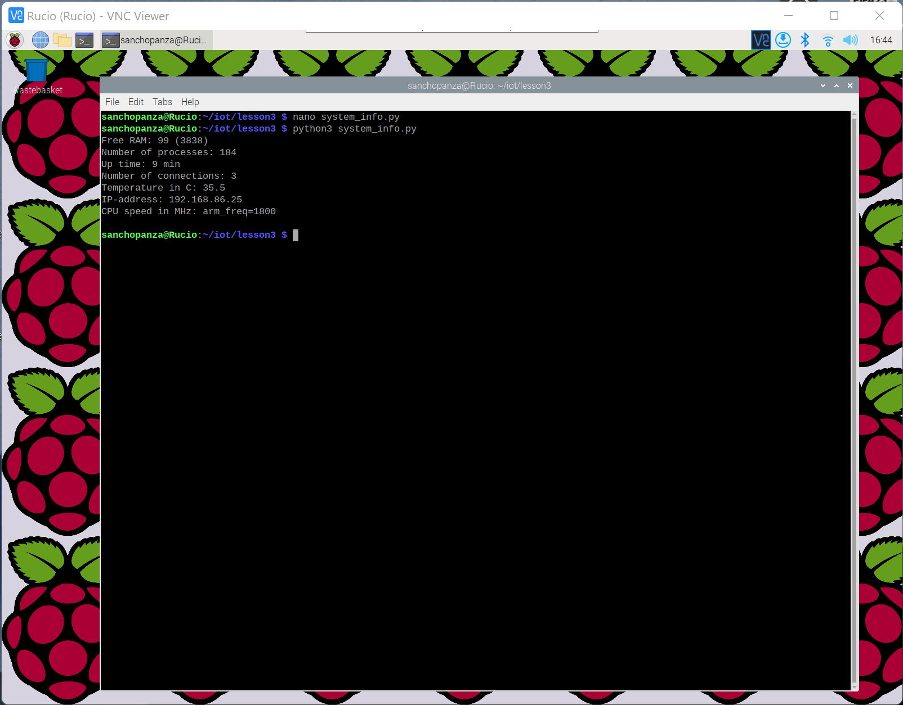
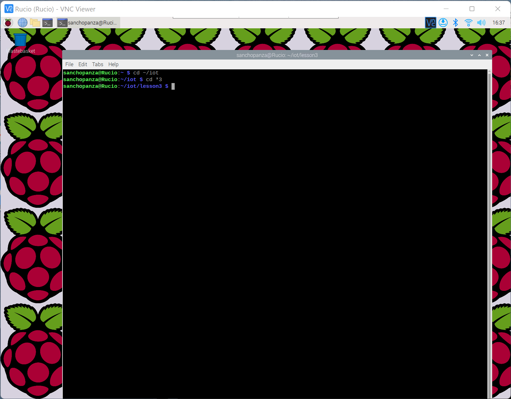
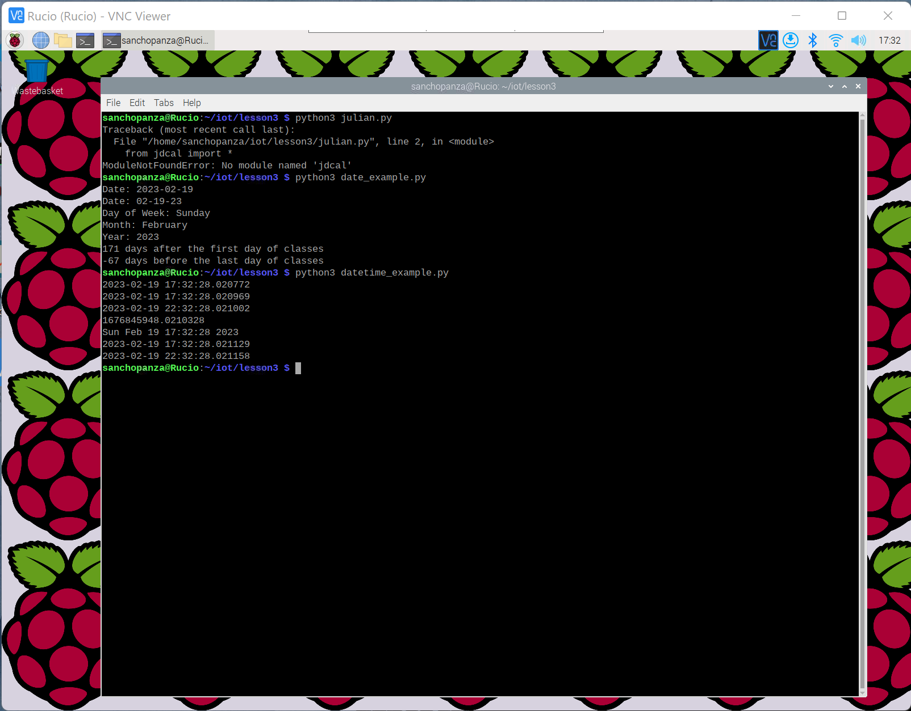
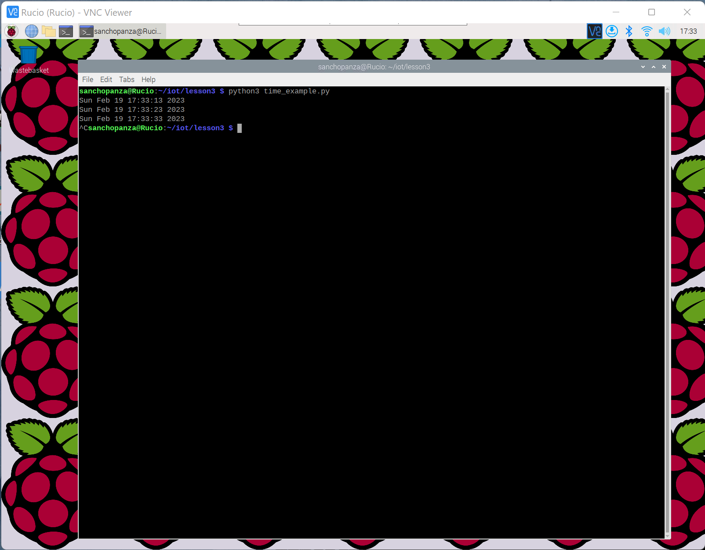
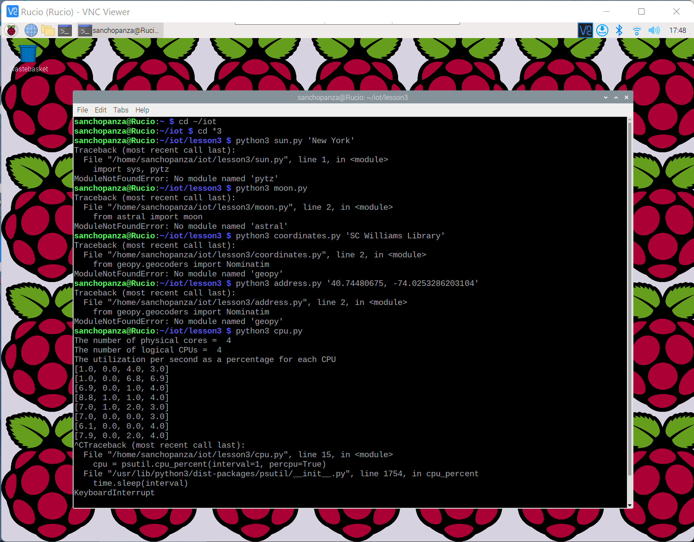
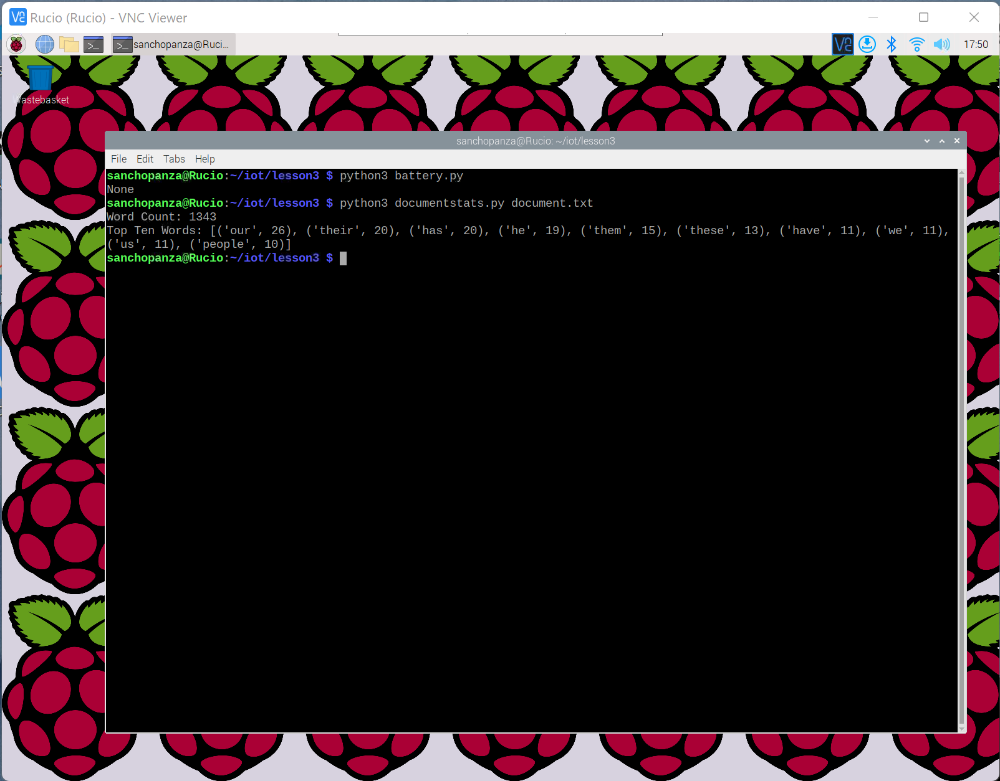

# CPE 322-A Lab 3: Python

## Assignment Overview 
The instructions for the assignment were as follows:
* Study the Github repository lesson 3 labs
* Install required Python packages such as jdcal, astral, and geopy
~~~
$ cd ~/iot
$ cd *3
$ python3 julian.py
$ python3 date_example.py
$ python3 datetime_example.py
$ python3 time_example.py
$ python3 sun.py 'New York'
$ python3 moon.py
$ python3 coordinates.py 'SC Williams Library'
$ python3 address.py '40.74480675, -74.02532862031404'
$ python3 cpu.py
$ python3 battery.py
$ python3 documentstats.py document.txt
~~~

## Using Raspberry Pi 
* Raspberry pi already has python 2, python 3, pip, and pip3 already installed and it is reccomended not to update these installation 
* One quick little thing that I did have to do in order to use my pi for the lab was to write some changes in the system_info.py file
* It was 2 quick changes to the directory where I changed /opt/vc/bin/vcgencmd to /usr/bin/vcgencmd
* Here you can see the output of running that file after making those changes:

## Results
The first two commands are just to get into the folder from the terminal

From there I ran julian.py-datetime_example.py and here are the outputs:

Then I ran the time_example.py program and was concerned by the fact that it went on, very slowly, forever. So I went to the program to see how to stop it and learned that by pressing ctrl+c the program quits.

I had trouble running the next few examples because my pi was telling me that I didn't have the python packages installed. I will ask around about this but I was not going to attempt to update the packages through pip or anything since it was very clear on the iot repo that you should not upgrade the pip or python packages that are already on the pi. So these are the results when they couldn't really run, from sun.py-cpu.py

The last two programs for this lab were battery.py and documentstats.py, here are the results:

> I may update the readme later on if I find out how to run those examples that I had trouble with

## References
* [IOT Repo](https://github.com/kevinwlu/iot)

## Stevens Institute of Technology, Computer Engineering, class of 2024

