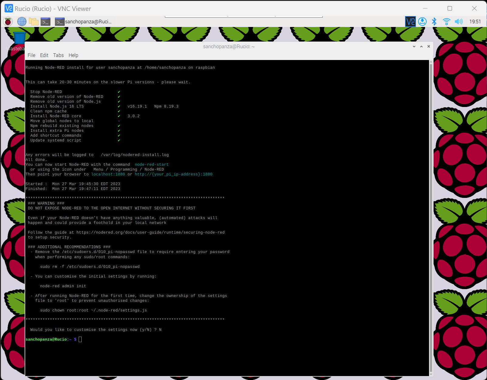
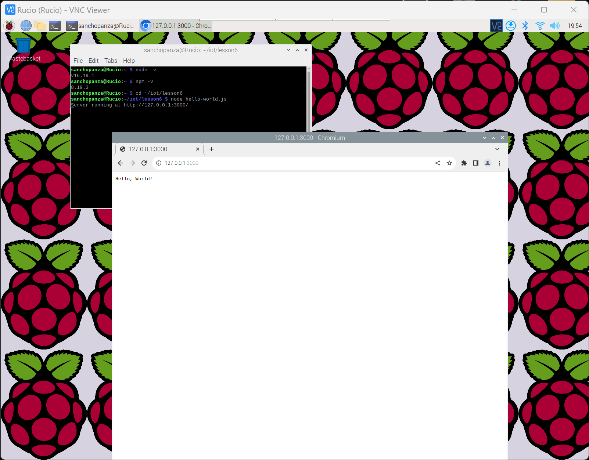
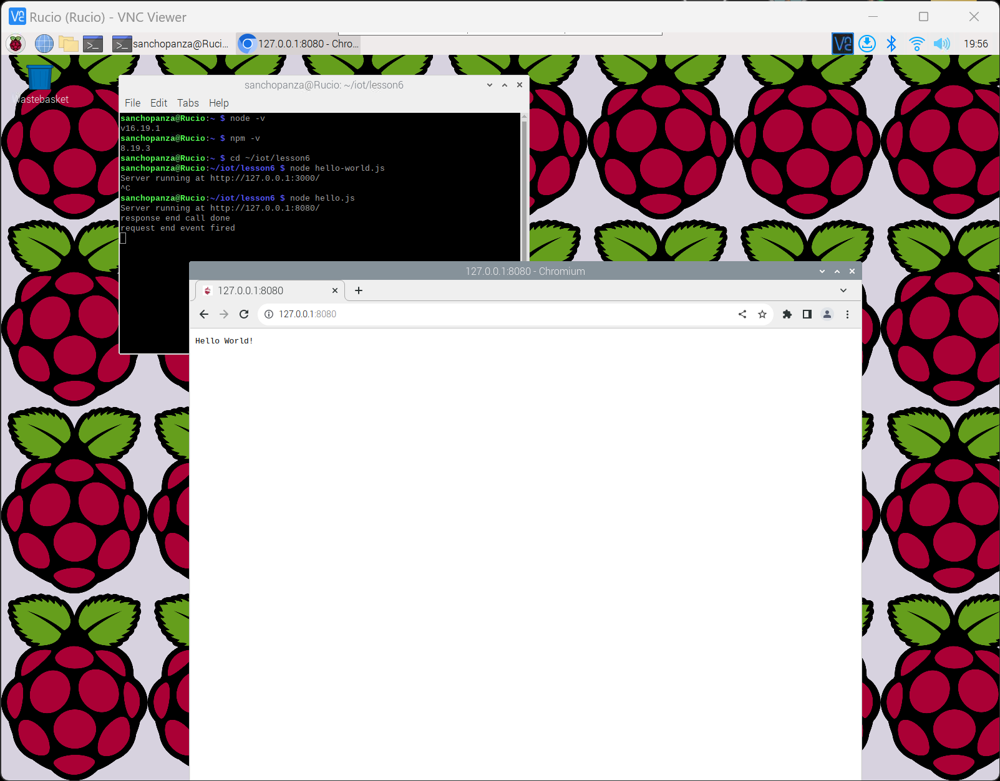
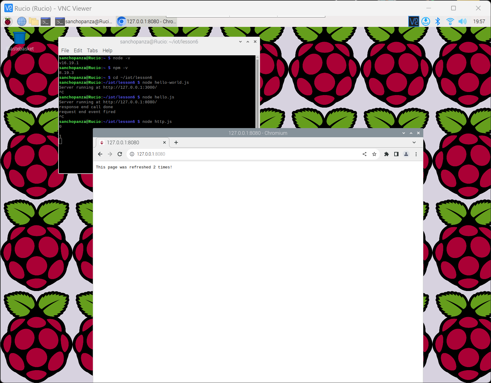
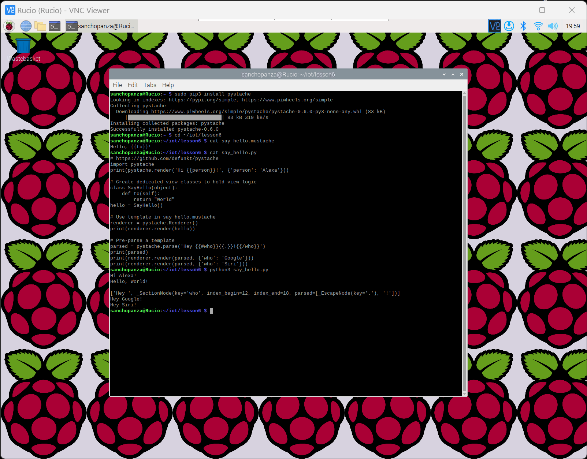

# CPE 322-A Lab 6: Node.js and Pystache

## Assignment Overview 
The instructions for the assignment were as follows:
* Study the GitHub repository Lesson 6 labs
* Install Node.js and run hello-world.js, hello.js, and http.js
* Install Pystache and run say_hello.py that uses the template in say_hello.mustache

## Using Raspberry Pi 
* Installing Node.js:

## Results
* Node.js examples:
  * Hello world

  * Hello

  * Http

* Pystache examples:
  * Installing Pystache and running say_hello.py

## References
* [IOT Repo](https://github.com/kevinwlu/iot)

## Stevens Institute of Technology, Computer Engineering, class of 2024

