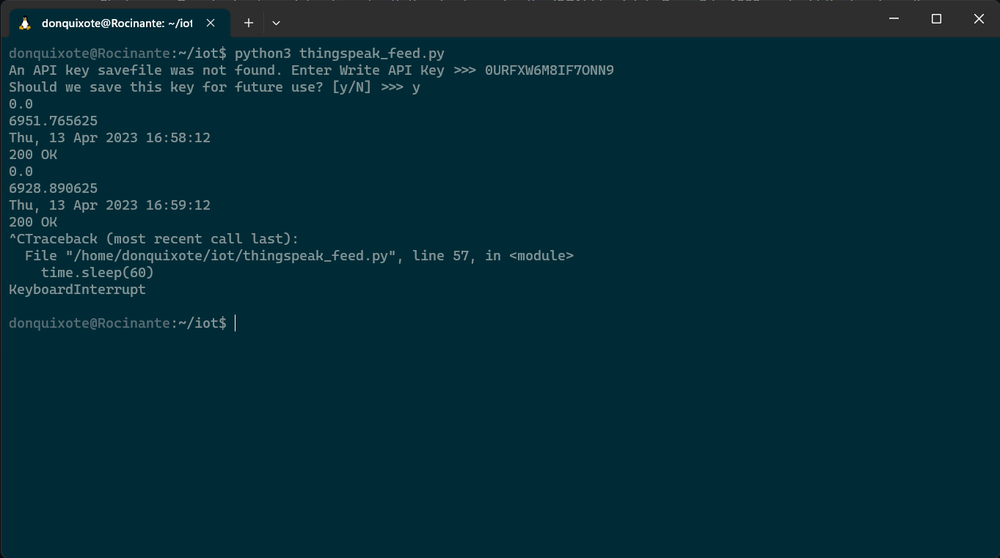
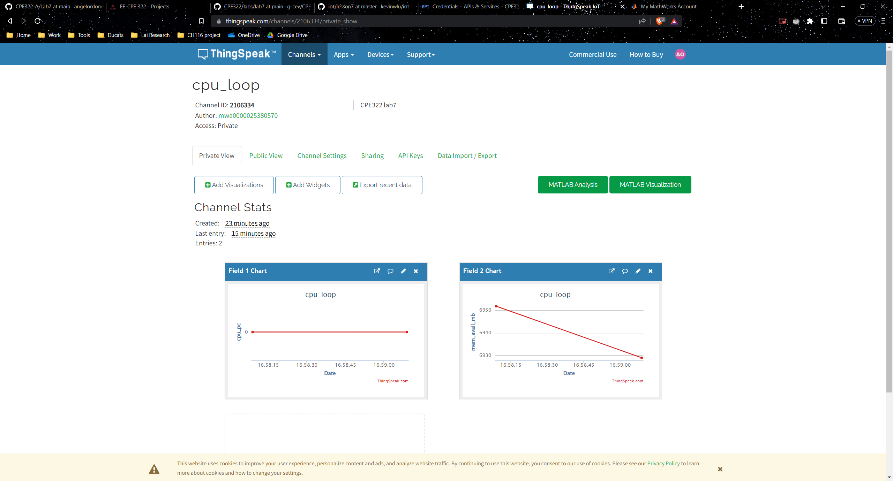
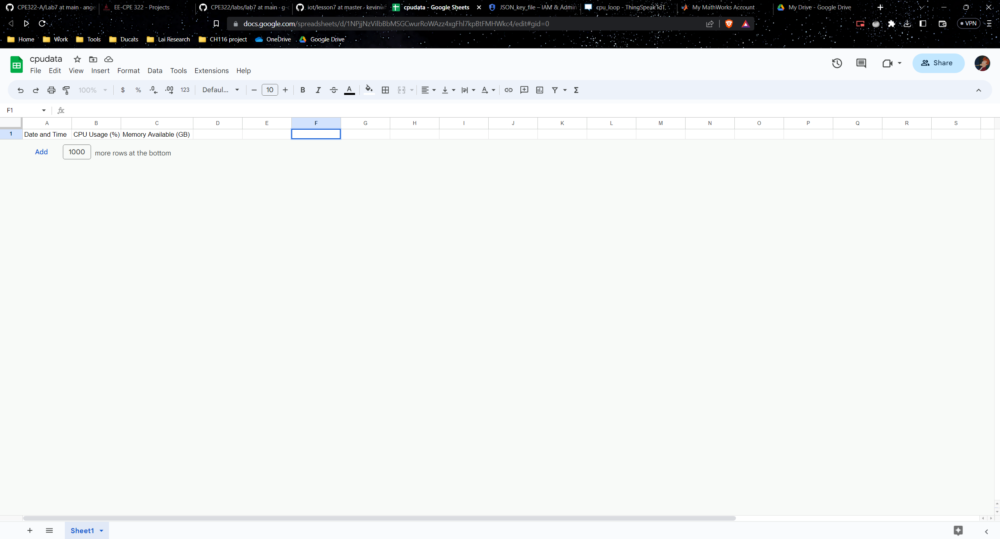
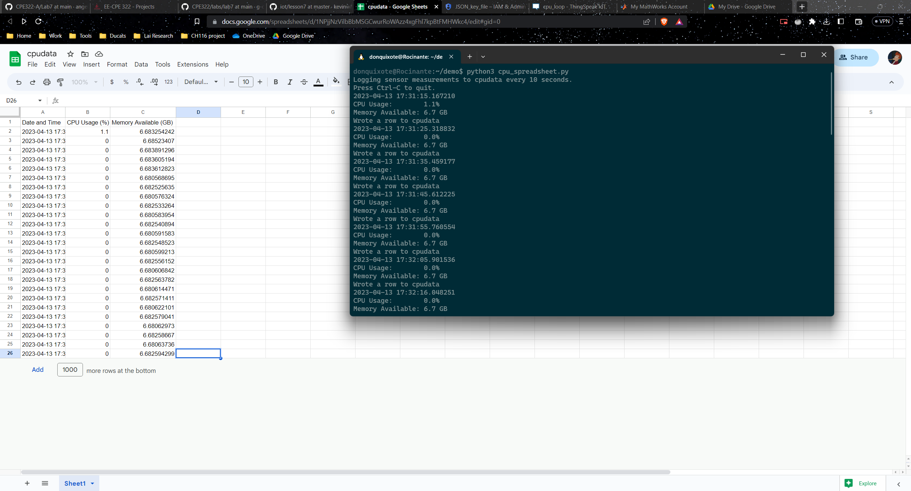

# CPE 322-A Lab 7: ThingSpeak and Google Sheets

## Assignment Overview 
The instructions for the assignment were as follows:
* Study the GitHub repository Lesson 7
* Sign up and log in MathWorks ThingSpeak
* Run thingspeak_cpu_loop.py or thingspeak_feed.py in a demo folder
* Install gspread and oauth2client
* Log in the Google Cloud Platform Identity and Access Management, create a project cpudata, enable both Drive API and Sheets API, create and download service account JSON key file
* Start a new Google sheet cpudata, share it with the client email in the JSON file, delete Rows 2 to 1000, and edit the header cells
* Run cpu_spreadsheet.py with the JSON key file in a demo folder

## Using WSL
In the past labs I've been using my raspberry pi for everything, but I know that other students use their regular windows terminal or WSL for labs. I decided to setup WSL and use it for the time being so that I could learn something new.

## Results
* thingspeak_feed.py

* Google Sheet before

* Google Sheet after

## References
* [IOT Repo](https://github.com/kevinwlu/iot)
* [WSL Setup](https://www.xda-developers.com/how-to-install-wsl-2-windows/)

## Stevens Institute of Technology, Computer Engineering, class of 2024

