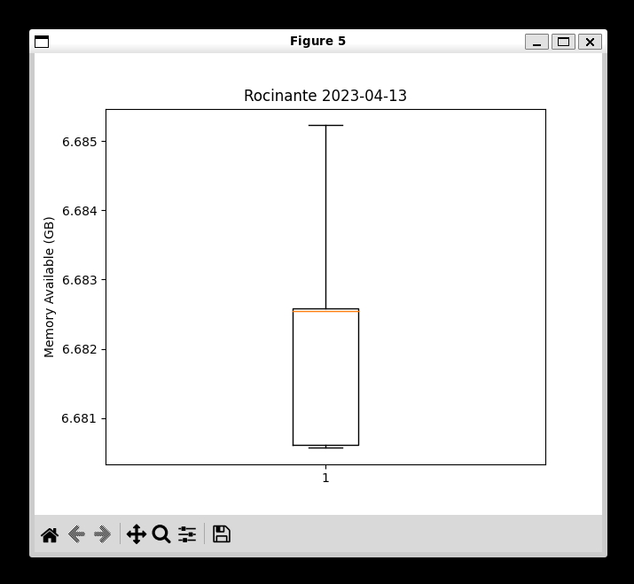

# CPE 322-A Lab 8: Data Analysis

## Assignment Overview 
The instructions for the assignment were as follows:
* Study the GitHub repository Lesson 8
* Install Python packages
* Save the Lab 7 Google sheet in CSV format to ~/demo
* Copy ~/iot/lesson8/plt_final.py and plt_cv2.py to ~/demo
* Edit plt_final.py and plt_cv2.py to read the CSV file with customized plot titles
* Run plt_final.py and plt_cv2.py

## Using WSL
* Copying the files into the demo folder

## Results
* the first 6 figures are from plt_final.py
* Figure 1

* Figure 2

* Figure 3

* Figure 4

* Figure 5

* Figure 6

the last figure is from plt_cv2.py
* Figure 7

## References
* [IOT Repo](https://github.com/kevinwlu/iot)

## Stevens Institute of Technology, Computer Engineering, class of 2024

