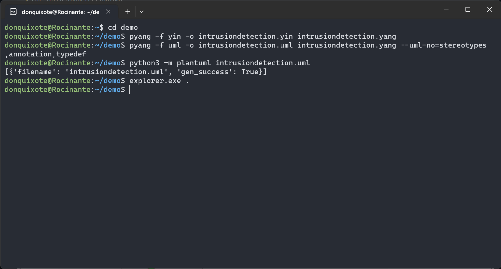
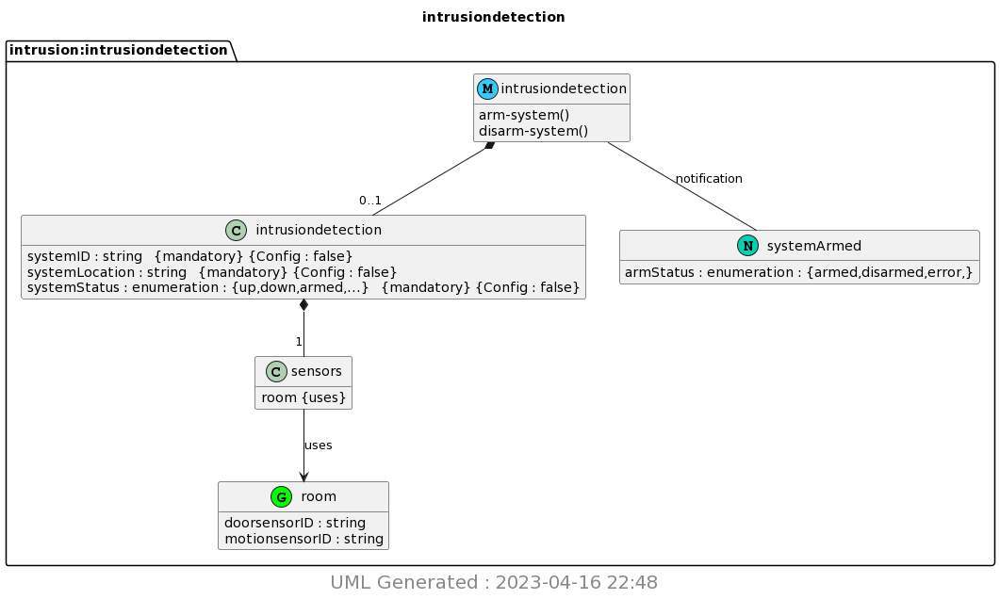

# CPE 322-A Lab 9: YANG

## Assignment Overview 
The instructions for the assignment were as follows:
* Study the GitHub repository Lesson 9
* Install pyang and PlantUML
* copy ~/iot/lesson9/intrusiondetection.yang to ~/demo
* Run pyang to generate intrusiondetection.yin and intrusiondetection.uml
* Run PlantUML to generate intrusiondetection.png

## Using WSL

## Results

## References
* [IOT Repo](https://github.com/kevinwlu/iot)

## Stevens Institute of Technology, Computer Engineering, class of 2024

